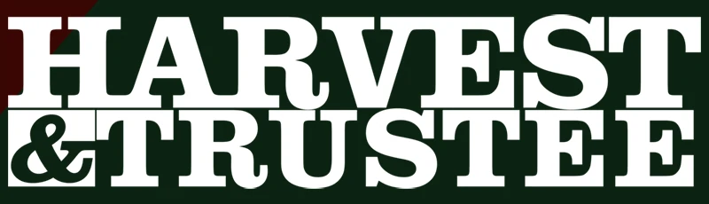

# Harvest and Trustee

# Built with:
Frontend: TypeScript, React, Html and CSS.

Backend: Java, Spring Boot (Backend code in different repo)

Misc: Docker

## Features: 

- Account Creation
- Account Login
- User Search
- Funds Request
- Funds Transfer
- Basic user authentication
- User profile view

# Banking Website:

[Link to Website](https://banking-app-9onp.onrender.com/)

# What I learned?

- How to use React more efficiently
- Styling
- Responsive design
- Java and Spring Boot

# Contact:
LinkedIn: www.linkedin.com/in/roland-piperal-932a4a347

# Info
This project is in no way related or affiliated with any oficcial Payday 2, Starbreeze or Overkill media/games.

This is a fan project with a purpose to learn and improve.
